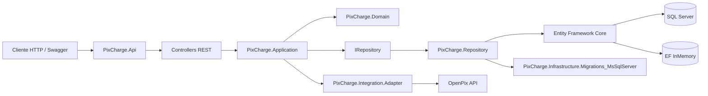
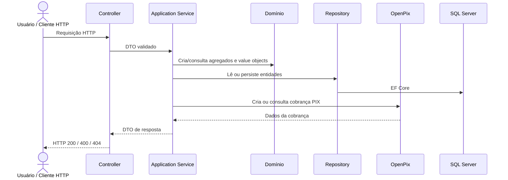
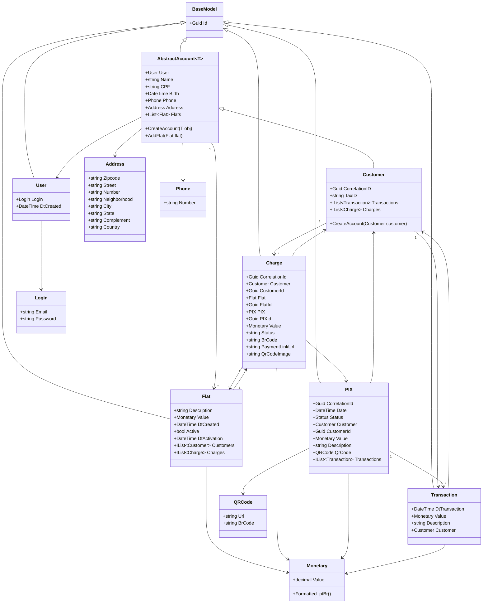
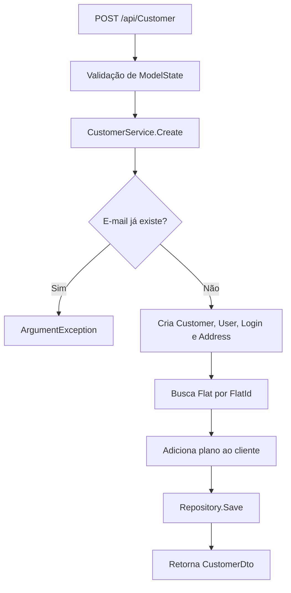
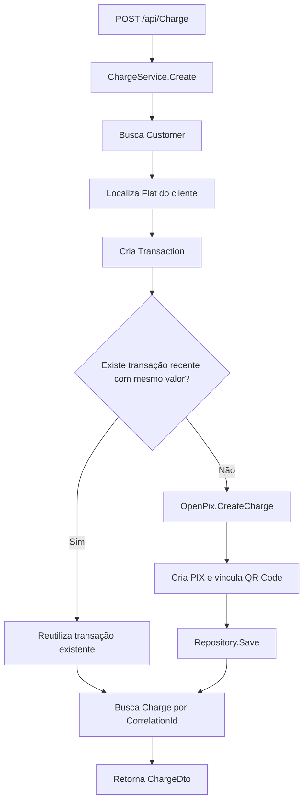
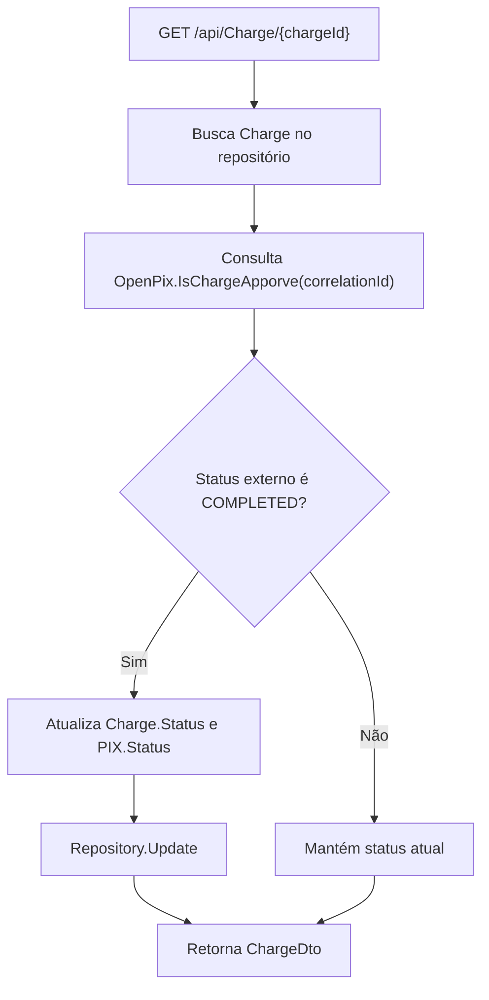

# Projeto Infnet Persistência de Serviços em Nuvem usando .Net - PixCharge

> API .NET para gestão de clientes, planos e cobranças PIX, com persistência em SQL Server, autenticação JWT, integração OpenPix e arquitetura em camadas.

       

## 📌 Sumário

- [PixCharge](#pixcharge)
  - [📌 Sumário](#-sumário)
  - [🧭 Visão geral](#-visão-geral)
  - [🧠 Legenda técnica](#-legenda-técnica)
  - [🎯 Objetivos do projeto](#-objetivos-do-projeto)
  - [🧩 Funcionalidades](#-funcionalidades)
  - [🏗️ Arquitetura da solução](#️-arquitetura-da-solução)
    - [Diagrama de Arquitetura - Visão geral da solução](#diagrama-de-arquitetura---visão-geral-da-solução)
    - [Camadas](#camadas)
    - [Diagrama de Arquitetura - Fluxo lógico](#diagrama-de-arquitetura---fluxo-lógico)
  - [🧬 Modelo de domínio](#-modelo-de-domínio)
    - [Diagrama de Classes - Modelo de domínio](#diagrama-de-classes---modelo-de-domínio)
    - [Regras de domínio relevantes](#regras-de-domínio-relevantes)
  - [🌐 API HTTP](#-api-http)
    - [Autenticação](#autenticação)
    - [Clientes](#clientes)
    - [Cobranças](#cobranças)
  - [🔁 Fluxos principais](#-fluxos-principais)
    - [Diagrama de Atividades - Cadastro de cliente](#diagrama-de-atividades---cadastro-de-cliente)
    - [Diagrama de Atividades - Criação de cobrança PIX](#diagrama-de-atividades---criação-de-cobrança-pix)
    - [Diagrama de Atividades - Consulta de cobrança](#diagrama-de-atividades---consulta-de-cobrança)
  - [🗄️ Persistência e dados iniciais](#️-persistência-e-dados-iniciais)
    - [Seed de dados](#seed-de-dados)
  - [🔌 Integrações externas](#-integrações-externas)
    - [OpenPix](#openpix)
    - [Conversão de resposta](#conversão-de-resposta)
  - [🔐 Segurança](#-segurança)
  - [📁 Estrutura do repositório](#-estrutura-do-repositório)
  - [⚙️ Configuração](#️-configuração)
    - [`appsettings.json`](#appsettingsjson)
    - [Ambiente de banco](#ambiente-de-banco)
  - [🚀 Execução local](#-execução-local)
    - [Pré-requisitos](#pré-requisitos)
    - [Restaurar dependências](#restaurar-dependências)
    - [Compilar](#compilar)
    - [Executar a API](#executar-a-api)
    - [Swagger](#swagger)
  - [🐳 Docker](#-docker)
  - [🧪 Testes e qualidade](#-testes-e-qualidade)
    - [Executar testes](#executar-testes)
    - [Executar testes com cobertura](#executar-testes-com-cobertura)
    - [Áreas cobertas](#áreas-cobertas)
  - [⚠️ Pontos de atenção](#️-pontos-de-atenção)
  - [🗺️ Roadmap técnico sugerido](#️-roadmap-técnico-sugerido)
  - [📄 Licença](#-licença)

## 🧭 Visão geral

O **PixCharge** é uma solução de backend construída em **ASP.NET Core 6** para cadastro de clientes, autenticação de usuários e geração de cobranças PIX vinculadas a planos. A aplicação organiza regras de negócio, persistência, contratos de API e integrações externas em projetos separados, favorecendo manutenção, testes e evolução incremental.

A solução contempla:

- 🌐 **API REST** com controllers para autenticação, clientes e cobranças.
- 🧩 **Domínio rico** com agregados, value objects e regras de validação.
- ⚙️ **Camada de aplicação** com services, DTOs e AutoMapper.
- 🗄️ **Persistência com Entity Framework Core**, SQL Server e banco em memória para testes.
- 🔐 **Autenticação JWT Bearer** com assinatura RSA.
- 🔌 **Integração OpenPix** para criação e consulta de cobranças PIX.
- 🧪 **Testes automatizados** com xUnit, Moq, Bogus e Coverlet.
- 🐳 **Suporte a Docker/Docker Compose** para empacotamento e execução em containers.

## 🧠 Legenda técnica

| Ícone | Significado |
| --- | --- |
| 🧭 | Visão arquitetural, decisão técnica ou orientação geral. |
| 🧩 | Domínio, regra de negócio, entidade ou value object. |
| ⚙️ | Serviço de aplicação, DTO, AutoMapper ou injeção de dependência. |
| 🌐 | API HTTP, controller, Swagger ou contrato REST. |
| 🗄️ | Persistência, Entity Framework, migrations ou seed de dados. |
| 🔌 | Integração externa, adapter ou contrato de plataforma. |
| 🔐 | Autenticação, autorização, criptografia ou configuração sensível. |
| 🧪 | Testes, cobertura, qualidade e automação. |
| ⚠️ | Lacuna, risco técnico ou recomendação de melhoria. |

## 🎯 Objetivos do projeto

- Gerenciar clientes com dados cadastrais, endereço, telefone, login e plano contratado.
- Criar cobranças PIX associadas a clientes e planos ativos.
- Consultar o status de uma cobrança PIX e refletir aprovação no domínio interno.
- Persistir clientes, planos, usuários, transações, cobranças e registros PIX.
- Disponibilizar uma base de testes abrangente para domínio, aplicação, repositórios, controllers e adapters.
- Separar responsabilidades por camada para reduzir acoplamento entre API, aplicação, domínio, infraestrutura e integrações.

## 🧩 Funcionalidades

| Área | Funcionalidade | Implementação principal |
| --- | --- | --- |
| 🔐 Autenticação | Login por e-mail e senha, com retorno de token JWT. | `AuthController`, `UserService`, `SigningConfigurations` |
| 👤 Clientes | Cadastro, consulta, atualização e exclusão de clientes. | `CustomerController`, `CustomerService` |
| 💳 Planos | Associação de clientes a planos ativos. | `Flat`, `DataSeederFlat`, `Customer.AddFlat` |
| ⚡ Cobrança PIX | Criação de cobrança a partir de cliente e plano. | `ChargeController`, `ChargeService`, `OpenPix` |
| 🔎 Consulta de cobrança | Busca por `Id` e atualização de status quando a cobrança estiver aprovada na OpenPix. | `ChargeService.FindById` |
| 🗄️ Seed de dados | Recriação da base e carga de planos/clientes de teste. | `DataSeeder`, `DataSeederFlat`, `DataSeederCustomer` |
| 📚 Swagger | Documentação interativa da API fora de produção. | `Program.cs`, `Swashbuckle.AspNetCore` |

## 🏗️ Arquitetura da solução

O projeto segue uma organização em camadas, com separação clara entre entrada HTTP, orquestração de casos de uso, domínio, persistência e adapters externos.

### Diagrama de Arquitetura - Visão geral da solução



### Camadas

| Camada | Projeto | Responsabilidade |
| --- | --- | --- |
| 🌐 API | `PixCharge.Api` | Controllers, Swagger, autenticação JWT, pipeline HTTP e inicialização da aplicação. |
| ⚙️ Aplicação | `PixCharge.Application` | Services, DTOs, perfis AutoMapper, autenticação e orquestração de regras. |
| 🧩 Domínio | `PixCharge.Domain` | Agregados, entidades, value objects, criptografia e regras invariantes. |
| 🗄️ Repositório | `PixCharge.Repository` | `DbContext`, mapeamentos EF Core, repositórios e seed de dados. |
| 🔌 Adapter | `PixCharge.Integration.Adapter` | Contratos e implementação de integração PIX, incluindo OpenPix. |
| 🧱 Migrations | `PixCharge.Infrastructure.Migrations_MsSqlServer` | Migrations EF Core para SQL Server e host auxiliar de execução. |
| 🧪 Testes | `PixCharge.Test` | Testes unitários e de integração por camada. |

### Diagrama de Arquitetura - Fluxo lógico



## 🧬 Modelo de domínio

O domínio está organizado em três áreas principais: **Account**, **Transactions** e **Core**.

| Contexto | Classes | Responsabilidade |
| --- | --- | --- |
| 👤 Account | `Customer`, `User`, `Flat`, `AbstractAccount` | Cadastro de clientes, login e planos. |
| ⚡ Transactions | `Charge`, `PIX`, `Transaction` | Cobranças, registros PIX e histórico transacional. |
| 🧱 Core | `BaseModel`, `Crypto`, `Monetary` | Identidade base, criptografia e valor monetário. |
| 📦 Value Objects | `Address`, `Login`, `Phone`, `QRCode`, `Status`, `TransactionType` | Tipos de valor e validações específicas do domínio. |

### Diagrama de Classes - Modelo de domínio



### Regras de domínio relevantes

- 🧩 `Monetary` não permite valores negativos.
- 🧩 `Phone` não permite número nulo ou vazio.
- 🧩 `Login` valida o formato do e-mail e criptografa a senha ao atribuir `Password`.
- 🧩 `CustomerService` impede cadastro de usuário com e-mail já existente.
- 🧩 `Customer.AddFlat` valida a inclusão de planos conforme estado de ativação.
- 🧩 `ChargeService` rejeita cobrança com valor menor ou igual a zero.
- 🧩 `ChargeService` evita criar nova transação PIX com mesmo valor dentro de uma janela mínima de tempo.

## 🌐 API HTTP

A API utiliza controllers ASP.NET Core com rota base `api/[controller]`.

### Autenticação

| Método | Rota | Descrição | Entrada | Saída |
| --- | --- | --- | --- | --- |
| `POST` | `/api/Auth` | Autentica usuário por e-mail e senha. | `LoginDto` | `AuthenticationDto` |

Exemplo de entrada:

```json
{
  "email": "user@customer.com",
  "password": "12345T!"
}
```

Exemplo de saída:

```json
{
  "accessToken": "jwt-token",
  "authenticated": true
}
```

### Clientes

| Método | Rota | Descrição | Entrada | Saída |
| --- | --- | --- | --- | --- |
| `GET` | `/api/Customer/{customerId}` | Busca cliente por identificador. | `Guid` na rota | `CustomerDto` |
| `POST` | `/api/Customer` | Cadastra cliente e associa plano. | `CustomerDto` | `CustomerDto` |
| `PUT` | `/api/Customer` | Atualiza cliente. | `CustomerDto` | `CustomerDto` |
| `DELETE` | `/api/Customer` | Remove cliente. | `Guid` no body | `bool` |

Exemplo de cadastro:

```json
{
  "name": "Cliente Exemplo",
  "email": "cliente@exemplo.com",
  "password": "Senha123!",
  "cpf": "123.456.789-00",
  "birth": "1990-01-01T00:00:00",
  "phone": "+5521999999999",
  "flatId": "3fa85f64-5717-4562-b3fc-2c963f66afa7",
  "address": {
    "zipcode": "20000-000",
    "street": "Rua Exemplo",
    "number": "100",
    "neighborhood": "Centro",
    "city": "Rio de Janeiro",
    "state": "RJ",
    "complement": "Sala 1",
    "country": "Brasil"
  }
}
```

### Cobranças

| Método | Rota | Descrição | Entrada | Saída |
| --- | --- | --- | --- | --- |
| `GET` | `/api/Charge/{chargeId}` | Busca cobrança e consulta aprovação na OpenPix. | `Guid` na rota | `ChargeDto` |
| `POST` | `/api/Charge` | Cria cobrança PIX para cliente/plano. | `ChargeDto` | `ChargeDto` |

Exemplo de criação:

```json
{
  "customerId": "473e3556-3219-4159-3551-08dc4f659a39",
  "flatId": "3fa85f64-5717-4562-b3fc-2c963f66afa7"
}
```

## 🔁 Fluxos principais

### Diagrama de Atividades - Cadastro de cliente



### Diagrama de Atividades - Criação de cobrança PIX



### Diagrama de Atividades - Consulta de cobrança



## 🗄️ Persistência e dados iniciais

A persistência é implementada com **Entity Framework Core** no projeto `PixCharge.Repository`.

| Item | Descrição |
| --- | --- |
| `RegisterContext` | `DbContext` principal com `DbSet` para `Customer`, `Flat`, `User`, `Charge`, `PIX` e `Transaction`. |
| `RepositoryBase<T>` | Implementa operações comuns: `Save`, `Update`, `Delete`, `GetAll`, `GetById`, `Find` e `Exists`. |
| `IRepository<T>` | Contrato genérico para persistência. |
| Mapeamentos EF | Configura entidades em `PixCharge.Repository/Mapping`. |
| Migrations SQL Server | Mantidas em `PixCharge.Infrastructure.Migrations_MsSqlServer`. |
| Banco em memória | Ativado quando o ambiente da API é `DatabaseInMemory`. |

### Seed de dados

O `DataSeeder` executa `EnsureDeleted()` e `EnsureCreated()` e carrega dados iniciais de planos e clientes.

| Tipo | Dados principais |
| --- | --- |
| Planos | Free, Basic, Standard e Premium. |
| Clientes | Usuários de teste com e-mails `free@user.com`, `basic@user.com`, `standard@user.com` e `user@customer.com`. |
| Senha de teste | `12345T!` |

⚠️ Em execução real, revise o comportamento do seed, pois ele recria a base ao iniciar a aplicação.

## 🔌 Integrações externas

### OpenPix

O projeto `PixCharge.Integration.Adapter` define o contrato `IPix` e a implementação `OpenPix`.

| Método | Responsabilidade |
| --- | --- |
| `CreateCharge(decimal value, string correlationID)` | Envia uma cobrança para a OpenPix e converte a resposta para `Charge`. |
| `IsChargeApporve(Guid correlationID)` | Consulta uma cobrança na OpenPix e retorna `true` quando o status externo é `COMPLETED`. |

### Conversão de resposta

O `ChargeParser` converte os modelos recebidos da OpenPix para o agregado `Charge`, preservando informações como `BrCode`, `QrCodeImage`, `PaymentLinkUrl`, `PixKey`, `Status`, `ExpiresIn` e identificadores externos.

## 🔐 Segurança

| Recurso | Implementação |
| --- | --- |
| JWT Bearer | Configurado em `AddAuthConfigurations`. |
| Assinatura | RSA SHA-256 via `SigningConfigurations`. |
| Claims | Inclui `Jti`, `UniqueName` e `UserId`. |
| Expiração | Controlada por `TokenConfigurations:Seconds`. |
| Criptografia de senha | AES em `Crypto`, acionado pelo value object `Login`. |
| HTTPS/HSTS | `UseHsts()` e `UseHttpsRedirection()` no pipeline da API. |

⚠️ A autenticação está configurada, mas o pipeline da API não chama `UseAuthentication()` e os controllers `CustomerController` e `ChargeController` não aplicam `[Authorize]` no código atual. Para proteger essas rotas, habilite a autenticação no pipeline e adicione a anotação ou configure uma política global de autorização.

⚠️ Os arquivos `appsettings.json` contêm valores sensíveis de exemplo, como chave de criptografia, autorização OpenPix e string de conexão. Em ambientes reais, mova esses dados para variáveis de ambiente, User Secrets, Azure Key Vault ou solução equivalente de gestão de segredos.

## 📁 Estrutura do repositório

```text
.
├── PixCharge.Api/                              API ASP.NET Core, controllers, Swagger e autenticação
├── PixCharge.Application/                      DTOs, services, AutoMapper e autenticação
├── PixCharge.Domain/                           Entidades, agregados, value objects e regras de domínio
├── PixCharge.Repository/                       DbContext, repositórios, mapeamentos EF e seed
├── PixCharge.Integration.Adapter/              Contratos e adapters de integração PIX
├── PixCharge.Infrastructure.Migrations_MsSqlServer/
│   └── Migrations/                             Migrations Entity Framework para SQL Server
├── PixCharge.Test/                             Testes automatizados
├── docker-compose*.yml                         Arquivos Docker Compose
├── generate_coverage_report.ps1                Script para relatório de cobertura
├── dotnet_test_watch_mode.ps1                  Script para execução de testes em modo watch
└── slnPixCharge.sln                            Solução .NET
```

## ⚙️ Configuração

### `appsettings.json`

| Chave | Descrição |
| --- | --- |
| `TokenConfigurations:Audience` | Audiência esperada do JWT. |
| `TokenConfigurations:Issuer` | Emissor esperado do JWT. |
| `TokenConfigurations:Seconds` | Tempo de expiração do token, em segundos. |
| `Crypto:Key` | Chave usada pelo serviço de criptografia. |
| `OpenPIX:Authorization` | Credencial de autorização da OpenPix. |
| `ConnectionStrings:MsSqlServerConnectionString` | String de conexão com SQL Server. |

### Ambiente de banco

| Ambiente | Comportamento |
| --- | --- |
| `DatabaseInMemory` | Usa EF Core InMemory com banco `Register`. |
| Demais ambientes | Usa SQL Server com migrations do projeto `PixCharge.Infrastructure.Migrations_MsSqlServer`. |

## 🚀 Execução local

### Pré-requisitos

- .NET SDK 6.0.
- SQL Server local ou containerizado.
- Credencial OpenPix válida para criação/consulta de cobranças.

### Restaurar dependências

```bash
dotnet restore slnPixCharge.sln
```

### Compilar

```bash
dotnet build slnPixCharge.sln
```

### Executar a API

```bash
dotnet run --project PixCharge.Api/PixCharge.Api.csproj
```

### Swagger

Em ambientes que não sejam produção, a documentação interativa fica disponível em:

```text
/swagger
```

## 🐳 Docker

O repositório possui arquivos Docker e Docker Compose para cenários de desenvolvimento e produção.

| Arquivo | Finalidade |
| --- | --- |
| `PixCharge.Api/Dockerfile` | Build multi-stage versionado no projeto da API; no estado atual, aponta internamente para `PixCharge.SPA`. |
| `PixCharge.Api/Dockerfile-Development` | Imagem para desenvolvimento. |
| `PixCharge.Api/Dockerfile-Production` | Imagem para produção. |
| `docker-compose.dev.yml` | Execução em ambiente `Staging`, portas `2000` e `2001`. |
| `docker-compose.prod.yml` | Execução em ambiente `Production`, portas `80` e `443`. |
| `docker-compose.override.yml` | Configuração complementar para ambiente de desenvolvimento. |

Exemplo de execução em desenvolvimento:

```bash
docker compose -f docker-compose.dev.yml up --build
```

⚠️ Alguns arquivos Compose referenciam `PixCharge.SPA`, enquanto a estrutura versionada analisada contém `PixCharge.Api`. Caso o projeto SPA não esteja presente no ambiente, ajuste o `dockerfile` e o serviço para apontar para o projeto correto.

## 🧪 Testes e qualidade

O projeto de testes utiliza **xUnit**, **Moq**, **Bogus**, **EF Core InMemory** e **Coverlet**.

### Executar testes

```bash
dotnet test slnPixCharge.sln
```

### Executar testes com cobertura

```bash
dotnet test PixCharge.Test/PixCharge.Test.csproj /p:CollectCoverage=true
```

### Áreas cobertas

| Área | Exemplos |
| --- | --- |
| 🌐 API | `AuthControllerTest`, `ChargeControllerTest`, `CustommerControllerTest` |
| ⚙️ Aplicação | `CustomerServiceTest`, `UserServiceTest`, `ChargeServiceTest` |
| 🔐 Autenticação | `SigningConfigurationsTest`, `TokenConfigurationTest` |
| 🧩 Domínio | Testes de `Customer`, `PIX`, `Transaction`, `Monetary`, `Login`, `Phone`, `Crypto` |
| 🗄️ Repositórios | Testes de `CustomerRepository`, `FlatRepository`, `PIXRepository`, `TransactionRepository`, `UserRepository` |
| 🧱 Mapeamentos | Testes de mapeamentos de conta e transações |
| 🔌 Adapter | `ChargeParserTest` |

## ⚠️ Pontos de atenção

- 🔐 **Segredos versionados**: mover chaves, credenciais OpenPix e strings de conexão para configuração segura.
- 🔐 **Autenticação e autorização nas rotas**: adicionar `UseAuthentication()` ao pipeline e aplicar `[Authorize]` nas rotas que exigem autenticação.
- 🗄️ **Seed destrutivo**: `EnsureDeleted()` remove a base na inicialização; separar comportamento de teste, desenvolvimento e produção.
- 🔌 **HttpClient**: substituir instanciação direta por `IHttpClientFactory` para melhor gestão de conexões e resiliência.
- ⚙️ **Operações síncronas em integração externa**: trocar `.Result` por chamadas assíncronas com `async/await`.
- 🧩 **Tratamento de exceções**: padronizar respostas de erro com middleware global e contratos de erro.
- 🐳 **Docker Compose**: revisar referências a `PixCharge.SPA` quando a execução esperada for a API `PixCharge.Api`.
- 🌐 **CORS**: configurar política explícita caso haja consumo por frontend externo.

## 🗺️ Roadmap técnico sugerido

- Implementar autorização efetiva nos endpoints sensíveis.
- Criar migrations e seeds separados por ambiente.
- Introduzir `IOptions<T>` para `OpenPix`, `Crypto` e JWT.
- Criar adapter OpenPix assíncrono com `IHttpClientFactory`.
- Adicionar health checks para banco de dados e integração externa.
- Implementar logs estruturados e correlação de requisições.
- Criar contratos OpenAPI mais detalhados com exemplos de request/response.
- Revisar nomes e ortografia técnica no código para melhorar legibilidade, por exemplo `IsChargeApporve` para `IsChargeApproved`.

## 📄 Licença

Este projeto está distribuído conforme os termos descritos no arquivo [LICENSE](LICENSE).
